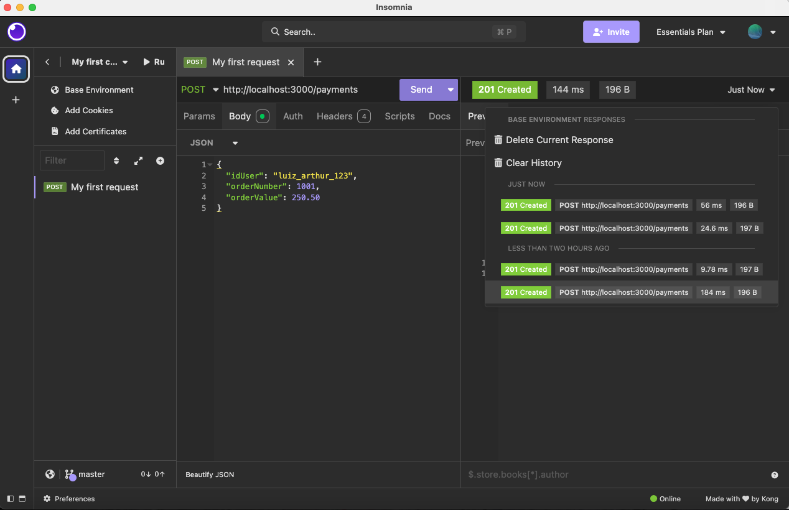
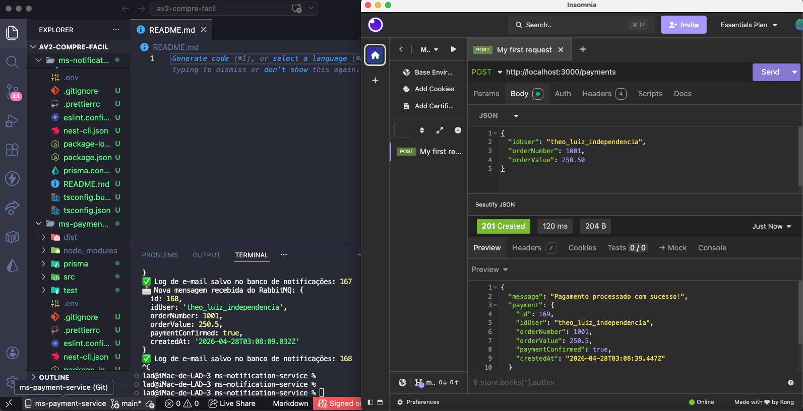
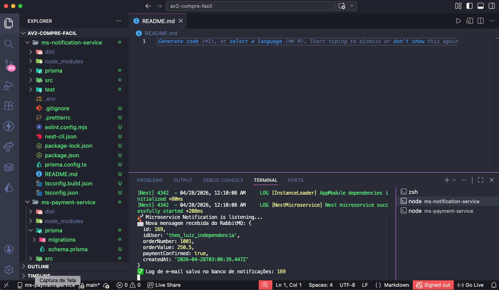
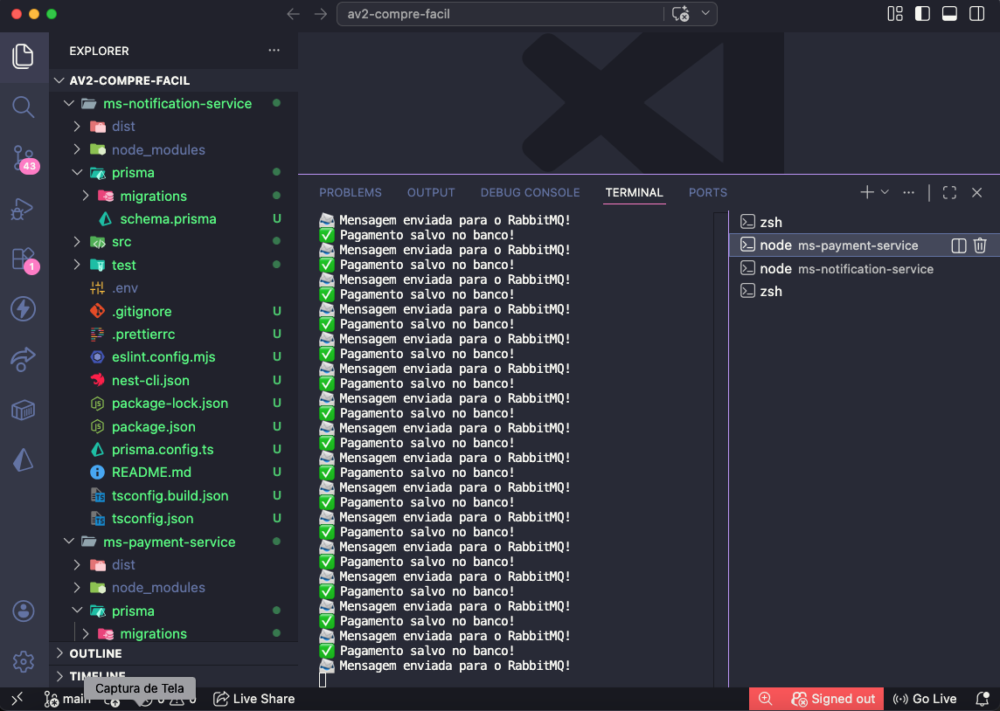
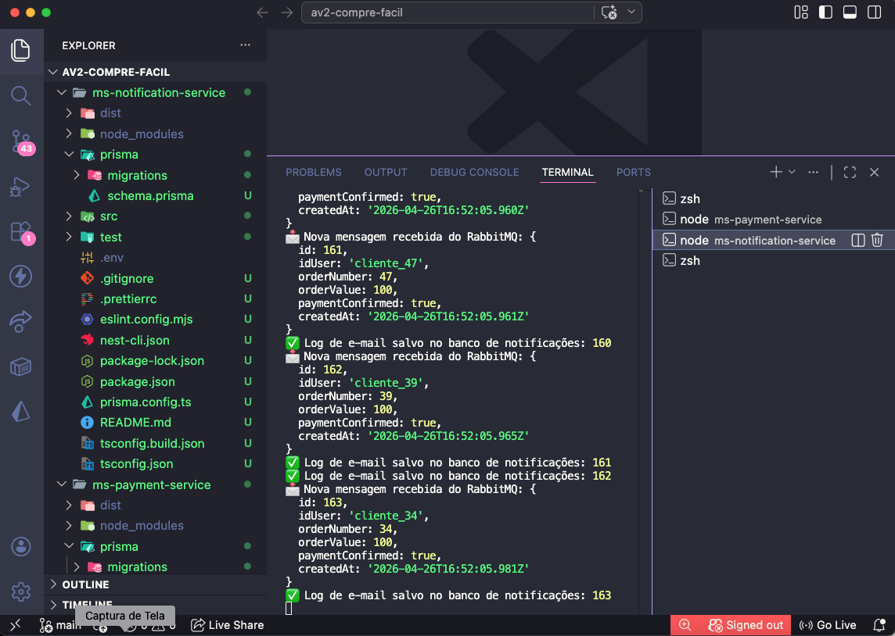

#  CompreFácil - Arquitetura de Microsserviços (AV2)

Este projeto é a entrega da avaliação AV2 da disciplina de Desenvolvimento de Sistemas Distribuídos. O objetivo principal é demonstrar a reestruturação da plataforma de e-commerce "CompreFácil" utilizando uma arquitetura de **Microsserviços** com comunicação assíncrona.

A solução foi projetada para resolver problemas de ociosidade de recursos e custos elevados, garantindo alta disponibilidade e permitindo que diferentes partes do sistema (Pagamento e Notificação) escalem de forma totalmente independente durante picos de vendas.


##  Arquitetura do Sistema

O projeto foi dividido em dois serviços independentes que se comunicam de forma assíncrona através de uma fila de mensagens (RabbitMQ):

1. **Payment Service (`ms-payment-service`)**: Responsável por receber a requisição de compra via API REST, processar/salvar o pagamento em seu próprio banco de dados e publicar um evento na fila informando o sucesso da transação.
2. **Notification Service (`ms-notification-service`)**: Fica "escutando" a fila de mensagens. Quando um pagamento é confirmado, ele consome essa mensagem e simula o envio de um e-mail de notificação para o usuário, salvando o registro em seu banco de dados exclusivo.

---

##  Ambiente de Desenvolvimento

Este software foi integralmente desenvolvido e testado no seguinte ambiente:

* **Hardware:** iMac (21.5-inch, 2017)
* **Sistema Operacional:** macOS Ventura (Versão 13.7.8)
* **Editor de Código:** Visual Studio Code (v1.117.0)
* **Client de API:** Insomnia (v12.5.0)

---

##  Tecnologias e Versões Utilizadas

Para garantir a estabilidade e o funcionamento correto deste projeto, as seguintes tecnologias e versões específicas foram utilizadas:

* **Node.js:** v22.22.1 (Interpretador e ambiente de execução)
* **NestJS:** Framework principal utilizado para estruturar ambos os microsserviços.
* **Prisma ORM:** **v6.0** (Tanto o `prisma` CLI quanto o `@prisma/client` foram fixados na versão 6 para garantir a integridade da geração do schema).
* **PostgreSQL:** Banco de dados relacional (Executado via Docker). Adotou-se o padrão *Database-per-Service* (bancos `payment` e `notification` isolados).
* **RabbitMQ:** Message Broker responsável pela fila de comunicação assíncrona (Executado via Docker).
* **Docker Desktop:** v4.48.0 (Engine: 28.5.1 / Compose: v2.40.2-desktop.1)

---

##  Como Executar o Projeto (Passo a Passo)

As instruções abaixo foram elaboradas para que qualquer desenvolvedor consiga rodar o projeto do zero em sua máquina.

### Pré-requisitos
Antes de começar, certifique-se de ter o **Node.js** e o **Docker Desktop** instalados e rodando em sua máquina.

### 1. Subindo a Infraestrutura (Banco e Fila)
Na pasta raiz do projeto, onde se encontra o arquivo `docker-compose.yml`, abra o terminal e rode o comando para baixar e ligar os containers do PostgreSQL e RabbitMQ em segundo plano:
`docker-compose up -d`

### 2. Instalando as Dependências
Abra dois terminais no VS Code, um para cada microsserviço, e instale as dependências:
`cd ms-payment-service && npm install`
`cd ms-notification-service && npm install`

### 3. Configurando os Bancos de Dados (Prisma)
Como os serviços são independentes, cada um precisa criar suas próprias tabelas no PostgreSQL.
No terminal do **ms-payment-service**, execute:
`npx prisma migrate dev --name init`

No terminal do **ms-notification-service**, execute o mesmo comando:
`npx prisma migrate dev --name init`
*(Nota: Certifique-se de que o arquivo `.env` de cada projeto aponta para bancos diferentes, ex: `/payment` e `/notification` na URL).*

### 4. Iniciando os Microsserviços
Com tudo configurado, inicie os servidores executando o seguinte comando em **ambos** os terminais:
`npm run start:dev`

Você deverá ver a mensagem `"🚀 Microservice is listening..."` em ambos os terminais, indicando sucesso.

---

##  Testando a API e Validando as Premissas (Evidências)

Para enviar uma requisição, utilize o Insomnia (ou Postman) e faça uma chamada do tipo **POST** para a rota do serviço de pagamento:

* **URL:** `http://localhost:3000/payments`
* **Body (JSON):**
```json
{
    "idUser": "theo_luiz_AV2",
    "orderNumber": 1001,
    "orderValue": 250.50
}
```

Abaixo estão as evidências de testes realizados.
1. Histórico de Requisições Rápidas
Prova de que o serviço de pagamento suporta múltiplas requisições sequenciais com respostas na casa dos milissegundos, demonstrando a eficiência da API.


Figura 1: Histórico do Insomnia demonstrando retornos de sucesso (201 Created) consistentes.

2. Independência e Resiliência (Teste de Falha)
Prova de que se o serviço de notificação ficar offline, o serviço de pagamento não cai. O usuário consegue finalizar a compra normalmente e a mensagem fica salva no RabbitMQ de forma segura.


Figura 2: Serviço de pagamento concluindo a transação com status 201 mesmo com o microsserviço de notificação desligado.

3. Recuperação e Comunicação Assíncrona
Prova de que as mensagens não são perdidas. Assim que o serviço de notificação é religado, ele se conecta ao RabbitMQ e consome a mensagem retida na fila automaticamente.


Figura 3: Serviço de notificação recuperando a mensagem na fila do RabbitMQ instantes após ser inicializado.

4. Escalabilidade sob Demanda (Teste de Estresse)
Execução de um script de teste simulando 50 compras simultâneas, em um terminal livre :
`for i in {1..50}; do curl -s -X POST http://localhost:3000/payments -H "Content-Type: application/json" -d "{\"idUser\": \"cliente_$i\", \"orderNumber\": $i, \"orderValue\": 100.00}" > /dev/null & done`

O serviço de pagamento processa as vendas instantaneamente (otimização de recursos), enquanto a notificação processa a fila cadenciada, sem sobrecarregar os servidores.


Figura 4: Terminal do ms-payment-service recebendo o pico de transações e roteando para a fila de forma ininterrupta.


Figura 5: Terminal do ms-notification-service consumindo a enxurrada de pedidos e executando as notificações no seu próprio tempo de processamento.

